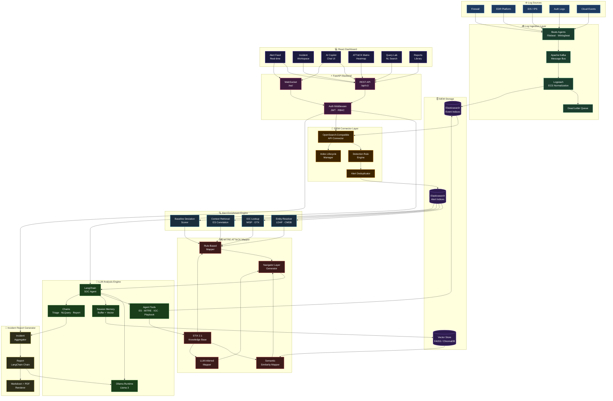
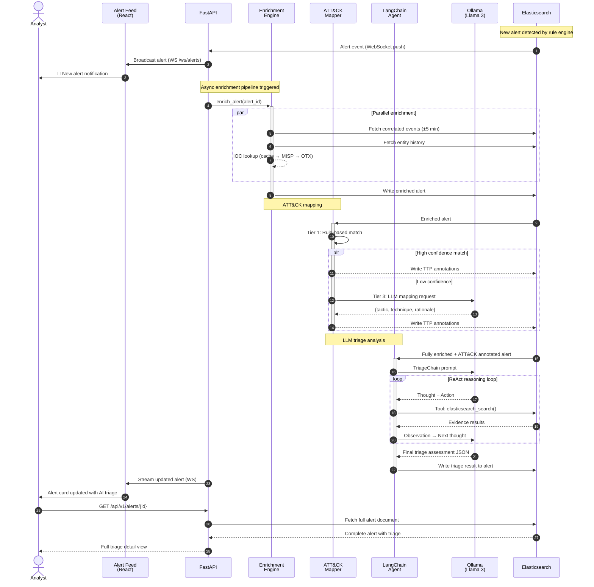
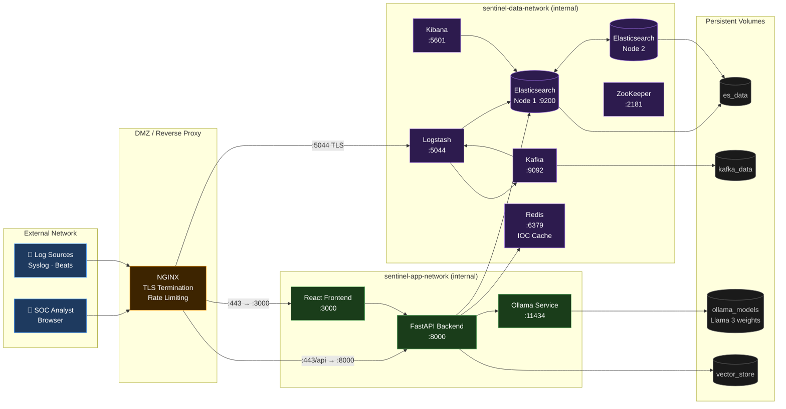

# Sentinel-AI Architecture Design

> **Document Type:** Technical Architecture  
> **Version:** 1.0.0  
> **Status:** Draft  
> **Last Updated:** 2026-06-16  

---

## Table of Contents

1. [Architecture Overview](#1-architecture-overview)
2. [Component Descriptions](#2-component-descriptions)
   - 2.1 [Log Ingestion Layer](#21-log-ingestion-layer)
   - 2.2 [SIEM Connector Layer](#22-siem-connector-layer)
   - 2.3 [Alert Enrichment Engine](#23-alert-enrichment-engine)
   - 2.4 [MITRE ATT&CK Mapper](#24-mitre-attck-mapper)
   - 2.5 [LLM Analysis Engine](#25-llm-analysis-engine)
   - 2.6 [Incident Report Generator](#26-incident-report-generator)
   - 2.7 [React Dashboard](#27-react-dashboard)
3. [Data Flow](#3-data-flow)
   - 3.1 [Primary Ingestion Flow](#31-primary-ingestion-flow)
   - 3.2 [Alert Triage Flow](#32-alert-triage-flow)
   - 3.3 [Analyst Query Flow](#33-analyst-query-flow)
4. [Mermaid Architecture Diagrams](#4-mermaid-architecture-diagrams)
5. [Deployment Considerations](#5-deployment-considerations)
6. [Scalability & Resilience](#6-scalability--resilience)
7. [Security Architecture](#7-security-architecture)

---

## 1. Architecture Overview

Sentinel-AI follows a **layered, event-driven microservice architecture** organized into seven distinct functional planes:

| Plane | Function | Primary Technology |
|-------|----------|--------------------|
| **Ingestion** | Collect and normalize raw security telemetry | Logstash, Fluent Bit, custom Python parsers |
| **Storage** | Persist and index structured security events | Elasticsearch / OpenSearch |
| **Enrichment** | Augment alerts with threat context | Python services, threat intel feeds |
| **Intelligence** | Map behaviors to ATT&CK TTPs | STIX/TAXII, custom MITRE mapper |
| **Reasoning** | LLM-driven triage and analysis | LangChain + Ollama (Llama 3) |
| **Reporting** | Generate structured incident artifacts | LangChain chains, Jinja2 templates |
| **Presentation** | Analyst-facing dashboard and copilot | React 18, WebSockets |

The entire platform is designed to operate **air-gapped**, with all LLM inference handled locally via Ollama. No security telemetry, analyst queries, or incident data leaves the organizational boundary.

---

## 2. Component Descriptions

### 2.1 Log Ingestion Layer

**Purpose:** The first point of contact for all raw security telemetry. Responsible for collecting, parsing, normalizing, and forwarding logs to the SIEM storage tier.

**Responsibilities:**
- Accept logs from heterogeneous sources in multiple formats (CEF, LEEF, syslog, JSON, Windows Event Log XML, EVTX)
- Apply Elastic Common Schema (ECS) field normalization to create a unified event model
- Perform timestamp normalization (UTC enforcement, timezone correction)
- Deduplicate events within a configurable time window
- Apply geo-IP enrichment, hostname resolution, and user agent parsing at ingest time
- Route events to appropriate Elasticsearch indices based on source type

**Sub-components:**

| Sub-component | Role | Format Support |
|---------------|------|----------------|
| **Syslog Receiver** | UDP/TCP syslog intake | RFC 3164, RFC 5424 |
| **Beats Agents** | Lightweight log shippers on endpoints | Filebeat, Winlogbeat, Auditbeat |
| **Fluent Bit** | Lightweight stream processor | JSON, syslog, regex |
| **Logstash Pipelines** | Heavy transformation and routing | CEF, LEEF, XML, JSON |
| **Custom Python Parsers** | EDR, CASB, and proprietary formats | Vendor-specific |
| **Kafka Bus** | Decoupled high-throughput buffer | Any serialized format |

**Key Design Decisions:**
- Kafka is placed between log shippers and Logstash to prevent backpressure from propagating upstream
- All normalization to ECS happens at this layer — downstream components consume only normalized events
- A Dead Letter Queue (DLQ) captures unparseable events for analyst review

---

### 2.2 SIEM Connector Layer

**Purpose:** Acts as the structured interface between the raw event store (Elasticsearch) and the Sentinel-AI analytical platform. Provides OpenSearch-compatible APIs and abstracts query complexity from higher layers.

**Responsibilities:**
- Expose an OpenSearch-compatible query API for broad SIEM interoperability
- Manage Elasticsearch Index Lifecycle Management (ILM) policies (hot/warm/cold/frozen tiers)
- Translate analyst-facing Natural Language queries into Elasticsearch DSL via the NL Query Chain
- Manage alert detection rules (stored as Kibana/OpenSearch Detection Rules format)
- Handle alert deduplication and suppression windows
- Provide aggregation APIs for dashboard metrics

**Sub-components:**

| Sub-component | Role |
|---------------|------|
| **ES Client Wrapper** | Async Python client for Elasticsearch 8.x |
| **Index Manager** | ILM policy enforcement, template management |
| **Rule Engine** | Alert rule evaluation, threshold detection |
| **Alert Deduplicator** | Fingerprint-based suppression within time windows |
| **Query Translator** | NL-to-DSL chain interface (feeds LLM Engine) |
| **Aggregation Service** | Pre-computed metrics for dashboard widgets |

**Index Strategy:**

```
sentinel-events-{source}-{YYYY.MM.dd}    →  Raw normalized events (hot: 7d, warm: 30d, cold: 1y)
sentinel-alerts-{YYYY.MM.dd}             →  Detected alerts (hot: 30d, warm: 90d)
sentinel-incidents-{YYYY}                →  Incident records (hot: 90d, warm: 3y)
sentinel-audit-{YYYY.MM.dd}             →  Platform audit logs (immutable, 2y)
sentinel-embeddings                      →  Vector embeddings for RAG (persistent)
```

---

### 2.3 Alert Enrichment Engine

**Purpose:** Transforms a raw alert signal into a contextually rich artifact ready for LLM analysis. Runs asynchronously as a pipeline triggered on every new alert.

**Responsibilities:**
- Pull related events from Elasticsearch within a configurable time window around the alert
- Resolve entities: hostname → IP → owner → department, user → role → privilege level
- Query threat intelligence sources for IOC reputation (IPs, domains, hashes, URLs)
- Retrieve historical context: prior alerts for the same entity, baseline deviation metrics
- Calculate a pre-LLM risk score using weighted heuristics
- Attach enrichment metadata to the alert document before LLM processing

**Enrichment Pipeline Stages:**

```
[Raw Alert]
    │
    ▼
[Entity Resolution]  ─── LDAP/AD lookup, CMDB query
    │
    ▼
[Context Retrieval]  ─── ES: correlated events (±5 min window)
    │
    ▼
[IOC Lookup]         ─── OTX, MISP, VirusTotal (internal cache first)
    │
    ▼
[Baseline Deviation] ─── Entity behavior baseline comparison
    │
    ▼
[Risk Scoring]       ─── Weighted heuristic score (0-100)
    │
    ▼
[Enriched Alert]     ─── Ready for MITRE mapping + LLM analysis
```

**Threat Intelligence Sources:**

| Source | Type | Caching | Freshness |
|--------|------|---------|-----------|
| MISP (internal) | IOC feeds | Redis, 1h TTL | Real-time push |
| AlienVault OTX | Public reputation | Redis, 4h TTL | API pull |
| Internal watchlists | User/host lists | In-memory | On-change reload |
| Passive DNS cache | Domain history | ES index | Daily refresh |

---

### 2.4 MITRE ATT&CK Mapper

**Purpose:** Classifies every enriched alert against the MITRE ATT&CK Enterprise framework, providing structured TTP annotations that enable campaign correlation and ATT&CK Navigator layer generation.

**Responsibilities:**
- Maintain a local copy of the ATT&CK STIX 2.1 knowledge base (synced from TAXII server or GitHub)
- Perform semantic similarity matching between alert text/fields and ATT&CK technique descriptions using vector embeddings
- Accept LLM-generated technique suggestions and validate them against the knowledge base
- Calculate TTP confidence scores for each mapping (Rule-based / Semantic / LLM-inferred)
- Generate ATT&CK Navigator JSON layers for campaign visualization
- Support sub-technique resolution (e.g., T1059 → T1059.001 PowerShell)

**Mapping Strategy (Tiered):**

```
Tier 1: Rule-based matching
   └── Exact keyword matches on known indicator patterns
   └── Regex patterns from ATT&CK data sources
   └── High confidence (>0.90), zero LLM cost

Tier 2: Semantic vector search
   └── Embed alert description → cosine similarity against technique embeddings
   └── Top-K candidates returned with similarity scores
   └── Medium confidence (0.65–0.90)

Tier 3: LLM inference
   └── Send enriched alert context to Llama 3 with ATT&CK taxonomy
   └── LLM returns structured JSON: {tactic, technique, sub_technique, rationale}
   └── Used when Tier 1 & 2 produce low confidence or no matches
```

**ATT&CK Data Model:**

```json
{
  "alert_id": "ALT-2026-00142",
  "mitre_mappings": [
    {
      "tactic": "Execution",
      "tactic_id": "TA0002",
      "technique": "Command and Scripting Interpreter",
      "technique_id": "T1059",
      "sub_technique": "PowerShell",
      "sub_technique_id": "T1059.001",
      "confidence": 0.94,
      "mapping_method": "rule_based",
      "rationale": "PowerShell.exe spawned with encoded command parameter"
    }
  ]
}
```

---

### 2.5 LLM Analysis Engine

**Purpose:** The cognitive core of Sentinel-AI. Orchestrates Llama 3 (via Ollama) through LangChain agents to perform contextual threat triage, hypothesis generation, and investigation guidance.

**Responsibilities:**
- Receive enriched, ATT&CK-annotated alerts and perform multi-step reasoning
- Generate structured triage assessments: severity classification, false-positive probability, analyst priority
- Answer analyst natural language questions about alerts, the environment, and threat behaviors
- Translate natural language queries to Elasticsearch DSL for NL-powered SIEM search
- Maintain per-session conversation memory to support coherent multi-turn investigations
- Invoke registered LangChain tools for live data retrieval during reasoning

**LangChain Agent Architecture:**

```
SOC Analyst Agent (ReAct)
│
├── Tools
│   ├── elasticsearch_search      ── Query event store for evidence
│   ├── mitre_technique_lookup    ── Fetch ATT&CK technique details
│   ├── ioc_reputation_check      ── Query threat intel for IOC score
│   ├── entity_history_lookup     ── Get entity's prior alert history
│   ├── playbook_retrieval        ── Fetch relevant SOC runbook
│   └── report_draft_tool         ── Trigger report generation chain
│
├── Memory
│   ├── ConversationBufferMemory  ── Short-term: current session context
│   └── VectorStoreRetrieverMemory── Long-term: semantic recall across sessions
│
└── Chains
    ├── TriageChain               ── Structured alert assessment
    ├── NLQueryChain              ── NL → ES DSL translation
    ├── CorrelationChain          ── Cross-alert campaign analysis
    └── ReportChain               ── Incident narrative generation
```

**Triage Output Schema:**

```json
{
  "alert_id": "ALT-2026-00142",
  "triage": {
    "severity": "HIGH",
    "priority_rank": 1,
    "false_positive_probability": 0.08,
    "confidence": 0.87,
    "classification": "Suspected Lateral Movement",
    "summary": "PowerShell encoded command executed by service account SVCACCT-SQL on workstation WS-FINANCE-14. This account has no historical PowerShell usage. The encoded payload decodes to a network reconnaissance command. Combined with a failed login from the same host 3 minutes prior, this warrants immediate investigation.",
    "recommended_actions": [
      "Isolate WS-FINANCE-14 from the network segment",
      "Reset credentials for SVCACCT-SQL",
      "Review all processes spawned by SVCACCT-SQL in the last 24 hours"
    ],
    "analyst_questions": [
      "Was there a change request for SVCACCT-SQL today?",
      "Are there any other hosts showing similar PowerShell patterns?"
    ]
  }
}
```

**Model Configuration:**

| Parameter | Value | Rationale |
|-----------|-------|-----------|
| Model | `llama3:8b` or `llama3:70b` | Balance of speed vs. reasoning depth |
| Temperature | `0.1` | Low randomness for deterministic security analysis |
| Context Window | `8192` tokens | Fits enriched alert + conversation history |
| Max Output | `2048` tokens | Prevents runaway generation |
| Format | `json` (structured output mode) | Ensures parseable triage responses |

---

### 2.6 Incident Report Generator

**Purpose:** Compiles all investigation artifacts — alert data, LLM analysis, ATT&CK mappings, entity context, and analyst notes — into a structured, professional incident report.

**Responsibilities:**
- Aggregate all alerts, enrichment data, LLM assessments, and analyst actions for an incident
- Generate a coherent narrative timeline using the ReportChain LangChain chain
- Produce both an executive summary (non-technical) and a technical deep-dive section
- Render reports in Markdown (for in-app viewing) and PDF (for distribution/archiving)
- Embed ATT&CK Navigator layers, entity graphs, and event timeline charts
- Assign CVSS-like severity scores and map to compliance frameworks (NIST, CIS)

**Report Structure:**

```
INCIDENT REPORT — INC-2026-00089
├── 1. Executive Summary
│   ├── Incident classification and severity
│   ├── Business impact assessment
│   └── Response status and key decisions
│
├── 2. Timeline of Events
│   ├── Chronological event table
│   └── Attack kill-chain visualization
│
├── 3. Technical Analysis
│   ├── Affected entities (users, hosts, IPs)
│   ├── Observed TTPs (ATT&CK mapping table)
│   ├── IOC listing (IPs, domains, hashes, signatures)
│   └── Evidence artifacts and log references
│
├── 4. Root Cause Analysis
│   └── LLM-generated hypothesis with evidence citations
│
├── 5. Remediation Actions
│   ├── Immediate containment steps (completed)
│   ├── Short-term hardening recommendations
│   └── Long-term strategic improvements
│
└── 6. Appendices
    ├── Raw alert references
    ├── ATT&CK Navigator layer (JSON + PNG)
    └── Analyst session transcript
```

---

### 2.7 React Dashboard

**Purpose:** The primary analyst-facing interface providing real-time situational awareness, investigation tooling, the AI copilot chat, and report access.

**Key Views:**

| Page | Description | Key Components |
|------|-------------|----------------|
| **Dashboard** | Real-time SOC overview | Alert severity donut, active incident counter, ATT&CK heatmap, top entities |
| **Alert Feed** | Paginated, filterable alert list | Alert cards with inline triage summary, status controls |
| **Incident Workspace** | Deep investigation view | Timeline, entity graph, ATT&CK matrix, evidence panel |
| **AI Copilot** | Chat-based analyst assistant | Streaming chat, suggested queries, inline evidence cards |
| **Query Lab** | NL SIEM search interface | Query input, DSL preview, result table, saved searches |
| **Reports** | Incident report library | Report cards, Markdown viewer, PDF export |
| **Threat Intel** | ATT&CK matrix and IOC browser | Interactive ATT&CK Navigator, IOC search |
| **Settings** | Platform configuration | User management, integration config, model settings |

**Real-time Architecture:**
- WebSocket connections to `/ws/alerts` stream new alerts directly to the Alert Feed
- WebSocket connections to `/ws/chat/{session}` stream LLM token-by-token responses for a fluid chat UX
- React Query handles server-state caching, background refetching, and optimistic updates
- Zustand stores manage client-side UI state (selected alerts, active session, filters)

---

## 3. Data Flow

### 3.1 Primary Ingestion Flow

```
Step 1: SOURCE EMISSION
   Firewall / EDR / IDS / Auth System generates a security event

Step 2: COLLECTION
   Log shipper (Filebeat / Fluent Bit / syslog) forwards to Kafka topic
   Topic: sentinel.raw.{source_type}

Step 3: STREAM PROCESSING (Logstash)
   Consumer group reads from Kafka
   → Apply grok/dissect patterns for parsing
   → Map fields to ECS schema
   → Enrich: GeoIP, hostname resolution, user agent
   → Forward to Elasticsearch

Step 4: INDEXING
   Elasticsearch indexes event to: sentinel-events-{source}-{date}
   ILM policy governs retention lifecycle

Step 5: RULE EVALUATION
   Detection rule engine evaluates each event against active rules
   → Pattern match / threshold / sequence detection
   → On match: create alert document in sentinel-alerts-{date}

Step 6: ALERT QUEUED
   New alert triggers async enrichment pipeline via message queue
```

### 3.2 Alert Triage Flow

```
Step 1: ENRICHMENT TRIGGER
   New alert in queue → Enrichment Engine picks up

Step 2: PARALLEL ENRICHMENT
   ┌─────────────────────────────────────────────┐
   │  Entity Resolution  │  IOC Lookup  │  Context │
   │  (LDAP, CMDB)       │  (MISP, OTX) │  Retrieval│
   └─────────────────────────────────────────────┘
   All three run in parallel (asyncio.gather)

Step 3: MITRE MAPPING
   Enriched alert → ATT&CK Mapper
   → Tier 1 rule match (if high confidence, skip Tier 2/3)
   → Tier 2 semantic search (vector similarity)
   → Tier 3 LLM inference (if still low confidence)
   → Attach mapping JSON to alert

Step 4: LLM TRIAGE
   Fully enriched + ATT&CK-annotated alert → LangChain SOC Agent
   → Agent may invoke tools (ES search, IOC check, playbook lookup)
   → TriageChain produces structured JSON assessment
   → Triage document written back to alert in Elasticsearch

Step 5: NOTIFICATION
   WebSocket broadcast to connected React clients
   → Alert appears in Feed with AI triage summary
   → High-severity alerts trigger desktop notification
```

### 3.3 Analyst Query Flow

```
Analyst types: "Show me all PowerShell executions from service accounts in the last 6 hours"
     │
     ▼
[React QueryLab] ──HTTP POST──► [FastAPI /api/v1/query/natural]
     │
     ▼
[NLQueryChain]
   → LLM receives: query text + schema context + examples
   → LLM outputs: structured Elasticsearch DSL query JSON
   → Chain validates DSL syntax
     │
     ▼
[SIEM Connector] ──► Elasticsearch executes DSL query
     │
     ▼
[Results] ──► FastAPI serializes hits to AlertSummary objects
     │
     ▼
[React QueryLab] renders result table + shows DSL breakdown
```

---

## 4. Mermaid Architecture Diagrams

### 4.1 Full System Architecture



---

### 4.2 Alert Triage Data Flow



---

### 4.3 Deployment Architecture (Docker Compose)



---

## 5. Deployment Considerations

### 5.1 Infrastructure Requirements

#### Minimum (Development / Pilot)

| Resource | Specification | Notes |
|----------|---------------|-------|
| CPU | 8 cores (x86-64) | AVX2 instruction set required for Ollama |
| RAM | 32 GB | Llama 3 8B requires ~6 GB VRAM / unified RAM |
| Storage | 200 GB SSD | OS + ES indices + model weights |
| GPU | Optional | NVIDIA with CUDA for Ollama GPU acceleration |
| OS | Ubuntu 22.04 LTS | Recommended; RHEL 9 also supported |

#### Production (Enterprise)

| Node Type | Count | CPU | RAM | Storage | Role |
|-----------|-------|-----|-----|---------|------|
| App servers | 2 | 16 cores | 64 GB | 100 GB SSD | FastAPI + React |
| LLM servers | 1–2 | 32 cores | 128 GB | 200 GB SSD | Ollama (GPU preferred) |
| ES data nodes | 3 | 16 cores | 64 GB | 2 TB NVMe | Hot tier |
| ES warm nodes | 2 | 8 cores | 32 GB | 10 TB HDD | Warm/cold tier |
| Kafka brokers | 3 | 8 cores | 32 GB | 1 TB SSD | Message bus |
| Logstash | 2 | 8 cores | 16 GB | 50 GB | Pipeline processing |

### 5.2 Network Architecture

```
Internet / Corporate WAN
        │
        ▼
   [WAF / DDoS Protection]
        │
        ▼
   [Load Balancer]  ─── Health checks, SSL termination
        │
        ├──► NGINX Cluster (DMZ)
        │         │
        │    [App Network]
        │    ├── React Frontend (CDN-cacheable static assets)
        │    └── FastAPI Backend (stateless, horizontally scalable)
        │              │
        │         [Data Network] (no external routing)
        │         ├── Elasticsearch cluster
        │         ├── Kafka cluster
        │         └── Ollama (LLM) servers
        │
        └──► Logstash (Log Intake, separate network segment)
```

**Network Segmentation Rules:**
- Log sources can only reach Logstash on port 5044 (TLS) — no direct ES access
- Ollama is never exposed outside the data network — only FastAPI can call it
- ES cluster is accessible only from FastAPI and Logstash — no direct analyst access
- All cross-network traffic is TLS 1.3 minimum
- Kibana (if deployed) is restricted to admin network segment only

### 5.3 High Availability Design

| Component | HA Strategy | RTO | RPO |
|-----------|-------------|-----|-----|
| FastAPI | Multiple replicas behind load balancer | < 30s | N/A (stateless) |
| Elasticsearch | 3-node cluster (1 master, 2 data), shard replication factor 2 | < 2 min | < 5 min |
| Kafka | 3 brokers, replication factor 3 | < 1 min | Zero (committed messages) |
| Ollama | Active-passive replica (model weights on shared NFS) | < 5 min | N/A (stateless) |
| Redis | Redis Sentinel or Redis Cluster | < 30s | < 1 min |

### 5.4 Capacity Planning

| Metric | Small SOC | Medium SOC | Large SOC |
|--------|-----------|------------|-----------|
| Events/day | 1M | 50M | 500M+ |
| Alerts/day | 500 | 10,000 | 100,000+ |
| AI triages/day | 500 | 5,000 | 50,000+ |
| ES storage/day | ~2 GB | ~100 GB | ~1 TB |
| Retention period | 90 days | 1 year | 3 years |
| Llama 3 model | 8B | 8B–70B | 70B (multi-GPU) |

### 5.5 LLM Performance Considerations

| Scenario | Latency | Throughput | Configuration |
|----------|---------|------------|---------------|
| Llama 3 8B (CPU only) | 8–15s/triage | ~4 triages/min | Development only |
| Llama 3 8B (GPU: RTX 4090) | 1–3s/triage | ~20 triages/min | Small/medium SOC |
| Llama 3 70B (8× A100) | 3–8s/triage | ~8 triages/min | Large SOC |
| Async queue-based processing | Decoupled | Scales horizontally | All production |

> **Recommendation:** Use a priority queue for alert triage. Critical/High severity alerts are processed immediately; Medium/Low alerts are batched and processed asynchronously to optimize GPU utilization.

### 5.6 Data Privacy and Compliance

| Requirement | Implementation |
|-------------|----------------|
| No data exfiltration | Ollama runs fully local; no external LLM API calls |
| Data at rest encryption | Elasticsearch transparent encryption; LUKS for volumes |
| Data in transit encryption | TLS 1.3 for all service communication |
| Log retention policy | ILM policies per data classification level |
| GDPR / data minimization | PII fields masked in Elasticsearch using field-level security |
| Audit trail | Immutable audit index with append-only role; cannot be deleted |
| Access control | JWT tokens with 8h expiry; RBAC enforced at API level |

### 5.7 Disaster Recovery

```
DR Runbook (outline):

1. PRIMARY FAILURE DETECTED (Elasticsearch cluster down)
   → Load balancer health check fails
   → Alerting triggers on-call notification

2. KAFKA AS BUFFER
   → Log sources continue shipping to Kafka
   → Events accumulate in Kafka (configured for 7-day retention)
   → No data loss during ES recovery window

3. ELASTICSEARCH RECOVERY
   → Restore from latest snapshot (S3 / MinIO)
   → Snapshots taken every 6 hours via ILM policy
   → Replay Kafka buffer to fill gap

4. APPLICATION RECOVERY
   → FastAPI replicas restart automatically (Compose restart policy: always)
   → Ollama restarts and model weights reload from persistent volume
   → Redis cache rebuilds from Elasticsearch on first access

5. VALIDATION
   → Alert ingestion smoke test
   → LLM triage smoke test
   → Dashboard connectivity check
```

---

## 6. Scalability & Resilience

### Horizontal Scaling Points

| Component | Scaling Axis | Scaling Method |
|-----------|-------------|----------------|
| FastAPI | Request throughput | Add replicas behind load balancer |
| Logstash | Ingest throughput | Add Logstash worker nodes, partition Kafka topics |
| Elasticsearch | Storage & query throughput | Add data nodes, increase shard count |
| Kafka | Message throughput | Add brokers, increase partition count |
| LLM Triaging | AI throughput | Add Ollama instances + GPU nodes, priority queue workers |

### Resilience Patterns

- **Circuit Breaker:** FastAPI → Ollama calls use circuit breaker (tenacity library). If Ollama is slow, triage degrades gracefully (returns heuristic score without LLM assessment).
- **Bulkhead:** LLM calls are isolated in a separate async worker pool — a surge in triage requests cannot starve REST API threads.
- **Retry with Backoff:** All ES and Kafka clients use exponential backoff with jitter.
- **Dead Letter Queue:** Unparseable log events and failed enrichment tasks are written to DLQ for manual review without blocking the pipeline.
- **Graceful Degradation:** If Ollama is unavailable, the system falls back to rule-based MITRE mapping and heuristic severity scoring. Alerts are still visible; AI summary is shown as "pending."

---

## 7. Security Architecture

### Authentication & Authorization

```
Request → NGINX → FastAPI Auth Middleware
                        │
                   JWT Validation
                        │
                   Role Extraction
                        │
              ┌────────────────────┐
              │   RBAC Decision    │
              ├────────────────────┤
              │ admin              │ Full access
              │ incident_commander │ Incident management + all alerts
              │ senior_analyst     │ All alerts + report generation
              │ analyst            │ Assigned alerts + read-only
              │ viewer             │ Dashboard read-only
              └────────────────────┘
```

### Prompt Injection Hardening

All alert content and analyst input is sanitized before LLM inclusion:

1. **Input boundary markers:** Alert content is wrapped in `<alert_data>...</alert_data>` XML tags in prompts — LLM is instructed to never follow instructions inside these tags.
2. **Structured output enforcement:** All LLM responses are parsed as JSON with Pydantic schema validation — free-form outputs that fail validation are rejected.
3. **Content length limits:** Alert fields are truncated to configurable maximum lengths before prompt injection.
4. **Keyword filtering:** Known prompt injection patterns are detected and sanitized before LLM submission, with audit log entries created for each occurrence.

### Audit Logging

Every security-relevant action is written to the `sentinel-audit-*` index:

```json
{
  "timestamp": "2026-06-16T15:30:00.000Z",
  "event_type": "AI_TRIAGE_COMPLETED",
  "actor": {
    "user_id": "analyst-001",
    "session_id": "sess-abc123",
    "ip_address": "10.0.1.50"
  },
  "resource": {
    "alert_id": "ALT-2026-00142",
    "incident_id": null
  },
  "llm_interaction": {
    "model": "llama3:8b",
    "prompt_tokens": 1842,
    "completion_tokens": 312,
    "latency_ms": 2140
  },
  "outcome": "SUCCESS",
  "triage_severity": "HIGH"
}
```

---

*This document is maintained by the Sentinel-AI architecture team. For questions, open an issue or contact the security engineering lead.*
